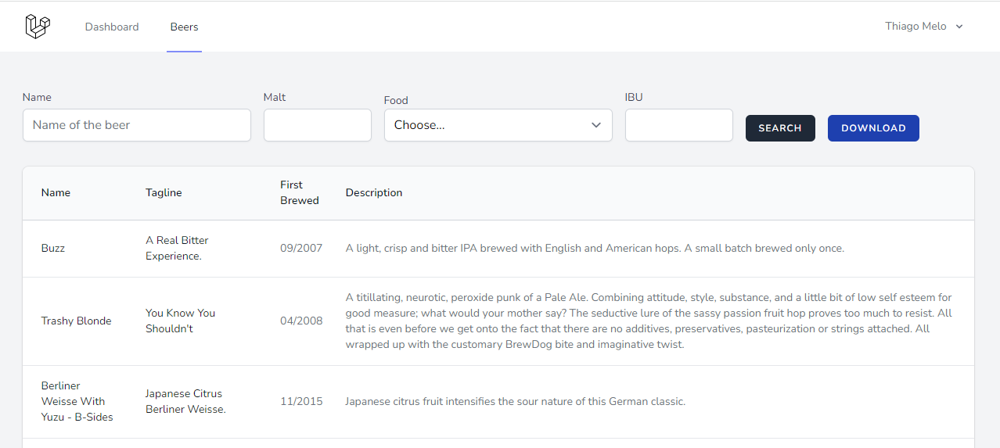

###  PUNK API
<br>



<br>

## Descrição
<br>
<p>API de catalogo de cerveja para harmonização com qualquer tipo de comida.</p>

## Instruções
<br>
<p>Faça um clone desse projeto.</p>

<p>Execute os seguintes comandos para configurações:</p>

```
sail  up -d
sail art  migrate
sail art migrate:refresh --seed
```

<br>

Subindo servidor Vite

```
 npm run dev
```

### Requisitos

- PHP 8.1
- Laravel 9
- Inertia
- Docker
- Redis
- Mailhog
- Minio
- MySQL


<br><br>
Made with :blue_heart:  by Thiago Melo :wave: [see my LinkedIn](https://www.linkedin.com/in/thiago-melo-10/)